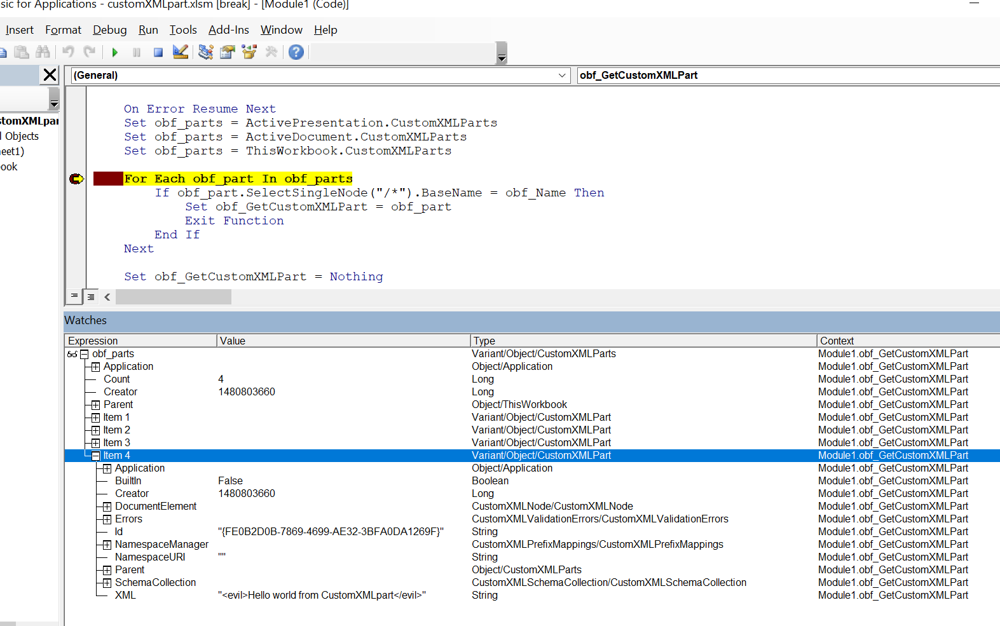

# CustomXMLPart

A PoC weaponising [Custom XML parts](https://docs.microsoft.com/en-us/visualstudio/vsto/custom-xml-parts-overview?view=vs-2022) for stealthily hiding malware code inside of Office document structures.



Technical explanation described in a dedicated blog post:
- [Backdooring Office Structures. Part 2: Payload Crumbs In Custom Parts](https://mgeeky.tech/payload-crumbs-in-custom-parts/)

## What it does?

The document provided simply displays a message box with a text extracted from a part.

---

### ☕ Show Support ☕

This and other projects are outcome of sleepless nights and **plenty of hard work**. If you like what I do and appreciate that I always give back to the community,
[Consider buying me a coffee](https://github.com/sponsors/mgeeky) _(or better a beer)_ just to say thank you! 💪 

---

```
Mariusz Banach / mgeeky, (@mariuszbit)
<mb [at] binary-offensive.com>
```
